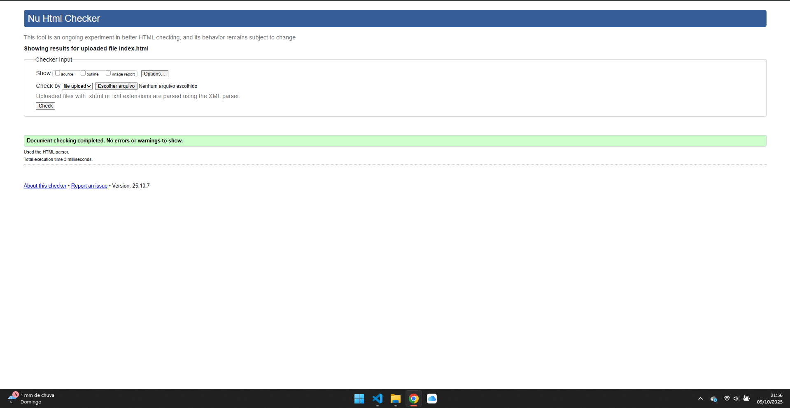
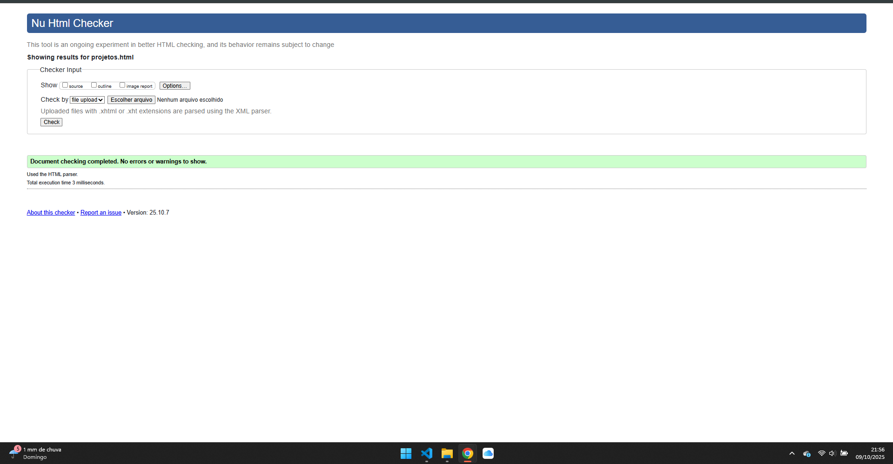
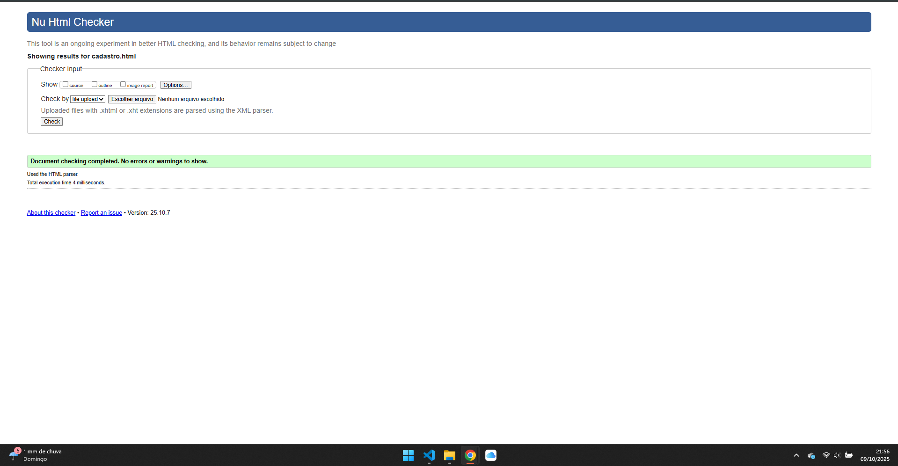

# Projeto ONG - Disciplina de Front-End

Este projeto consiste na criação de um website institucional para uma ONG fictícia, como parte da avaliação da disciplina de Desenvolvimento Front-End.

A primeira entrega focou na estruturação semântica do conteúdo utilizando exclusivamente HTML5.

---

## ✅ Validação W3C

Abaixo estão os comprovantes de validação de conformidade do código HTML de todas as páginas do projeto, utilizando o serviço oficial do W3C.

### Página Inicial (index.html)

### Página de Projetos (projetos.html)

### Página de Cadastro (cadastro.html)
